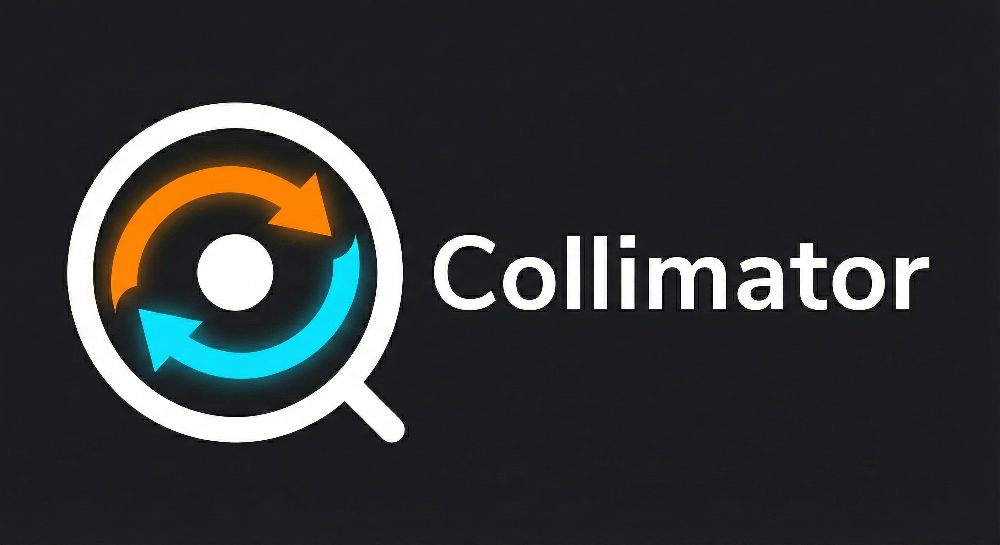

<p align="center">
  
</p>

# Collimator


A profunctor optics library for Lean 4.

Optics (lenses, prisms, traversals, etc.) are encoded as polymorphic functions over profunctors, enabling composable, type-safe data access and modification patterns.

*Developed in collaboration with [Claude](https://claude.ai) and [Codex](https://openai.com/index/openai-codex/).*

## Installation

Add to your `lakefile.lean`:

```lean
require collimator from git "https://github.com/nathanial/collimator" @ "master"
```

Then run:

```bash
lake update
lake build
```

**Requirements:** Lean 4.25.2 or compatible version.

## Documentation

- **[Examples](examples/)** - Real-world usage patterns:
  - [JSON Navigation](examples/JsonLens.lean)
  - [Configuration Management](examples/ConfigUpdate.lean)
  - [Form Validation](examples/FormValidation.lean)
  - [Tree Traversal](examples/TreeTraversal.lean)
  - [Database Records](examples/DatabaseRecords.lean)
  - [Indexed Optics](examples/IndexedOptics.lean)

## Quick Start

```lean
import Collimator.Prelude  -- Batteries-included import

-- Define a simple structure
structure Person where
  name : String
  age : Nat

-- Create a lens for the 'age' field
def ageLens : Lens' Person Nat :=
  lens' (fun p => p.age) (fun p a => { p with age := a })

-- Use the lens
def birthday (p : Person) : Person :=
  over ageLens (· + 1) p

def getAge (p : Person) : Nat :=
  view ageLens p

-- Or use operator syntax
open scoped Collimator.Operators

def example (p : Person) : Person :=
  p & ageLens %~ (· + 1)  -- increment age

#eval (Person.mk "Alice" 30) ^. ageLens  -- 30
```

## Optic Types

Collimator provides a hierarchy of optics, each with different capabilities:

| Optic | Focus | Capabilities |
|-------|-------|--------------|
| `Iso` | Exactly 1 (isomorphic) | view, over, review |
| `Lens` | Exactly 1 | view, over |
| `Prism` | 0 or 1 | preview, review, over |
| `AffineTraversal` | 0 or 1 | preview, over |
| `Traversal` | 0 or more | traverse, over, fold |
| `Fold` | 0 or more (read-only) | fold |
| `Setter` | 0 or more (write-only) | over |

### Monomorphic vs Polymorphic

Each optic comes in two variants:
- **Polymorphic**: `Lens s t a b` - can change the type during modification
- **Monomorphic**: `Lens' s a = Lens s s a a` - type-preserving (use the prime `'` suffix)

## Core Operations

```lean
-- Extract a value (Lens, Iso)
view : optic → s → a

-- Modify a value
over : optic → (a → b) → s → t

-- Replace a value
set : optic → b → s → t

-- Maybe extract (Prism, AffineTraversal)
preview : optic → s → Option a

-- Construct from focus (Prism, Iso)
review : optic → b → t

-- Effectful traversal
traverse : optic → (a → F b) → s → F t
```

## Composition

Optics compose with standard function composition. The resulting optic type is determined by the most restrictive operand:

```lean
-- Lens ∘ Lens = Lens
-- Lens ∘ Prism = AffineTraversal
-- Traversal ∘ Traversal = Traversal

def nested : Lens' Outer Inner := ...
def field : Lens' Inner Value := ...

def deepLens : Lens' Outer Value := nested ∘ field
```

## Architecture

### Profunctor Hierarchy

The library is built on a hierarchy of profunctor type classes:

```
Profunctor
    ├── Strong    (products → Lens)
    ├── Choice    (sums → Prism)
    ├── Closed    (functions)
    └── Wandering (traversables → Traversal)
```

### How It Works

Each optic is a polymorphic function constrained by profunctor capabilities:

```lean
structure Lens (s t a b : Type*) where
  run : {P : Type* → Type* → Type*} → [Profunctor P] → [Strong P] → P a b → P s t
```

Operations are implemented by instantiating `P` with specific concrete profunctors:
- `Forget R` for `view` (extracts the focus)
- `Star F` for `traverse` (threads effects)
- `Tagged` for `review` (constructs values)
- `FunArrow` for `over` (modifies in place)

## Module Structure

```
Collimator/
├── Core.lean         # Profunctor, Strong, Choice, Wandering, Closed
├── Optics.lean       # Iso, Lens, Prism, Affine, Traversal, Fold, Setter
├── Combinators.lean  # Composition, indexed, filtered
├── Operators.lean    # Operator syntax (^., %~, &, etc.)
├── Instances.lean    # Array, List, Option, Prod, Sum instances
├── Concrete/         # Forget, Star, Costar, FunArrow, Tagged
├── Theorems/         # Law proofs, equivalences, normalization
├── Derive/           # Macro support for automatic lens generation
└── Prelude.lean      # Batteries-included import
```

## Building & Testing

```bash
# Build the library
lake build

# Run all tests (265+ tests)
lake build collimator_tests && .lake/build/bin/collimator_tests
```

## License

MIT License - see [LICENSE](LICENSE) for details.

## References

- [Profunctor Optics: Modular Data Accessors](https://arxiv.org/abs/1703.10857) - Pickering, Gibbons, Wu
- [Optics By Example](https://leanpub.com/optics-by-example) - Chris Penner
